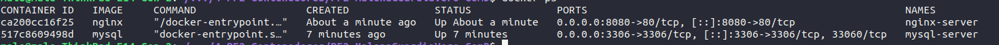
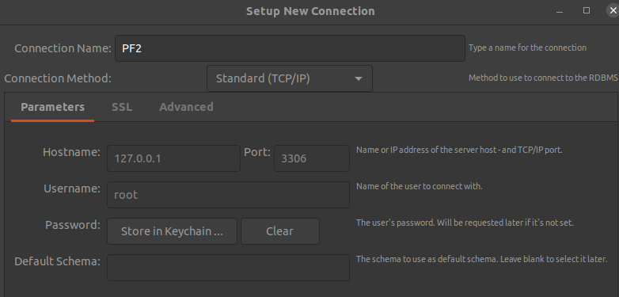
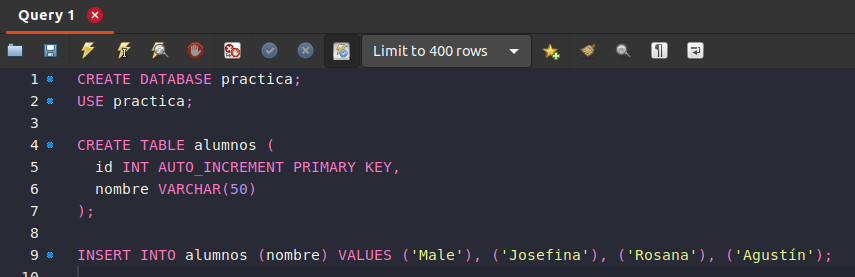

# 2025 DevOps - PF2 Contenedores

**Seminario de Actualización DevOps** 

**_Malena Guardia Vero_**
**_Comisión D_**  
**_IFTS 29_**  
**_Fecha:_** 11/09/2025


---

## PARTE 1

### 1. Verificación de instalación de Docker y Docker Compose

```bash
docker --version
docker-compose --version
# Docker version 28.1.1, build 4eba377
# Command 'docker-compose' not found, but can be installed with (...)
```

> **Nota:** Docker ya está instalado, pero falta Docker Compose por lo que avanzo con la instalación.

---

### 2. Instalación de Docker Compose

```bash
sudo apt install docker-compose
```

---

### 3. Verificación de Docker Compose

```bash
docker-compose --version
# docker-compose version 1.25.0, build unknown
```

---

### 4. Búsqueda y descarga de imagen de Nginx en Docker Hub

```bash
docker search nginx
docker pull nginx
```

> **Nota:** El primer comando busca imágenes de Nginx en Docker Hub; el segundo descarga la imagen oficial.

---

### 5. Creación de un contenedor Nginx

```bash
docker run -d --name nginx-server -p 8080:80 nginx
```

> **Nota:** `--name` asigna nombre al contenedor y `-p` mapea el puerto 8080 de localhost al 80 del contenedor.

---

### 6. Repetición de pasos para MySQL

```bash
docker pull mysql
docker run -d --name mysql-server -e MYSQL_ROOT_PASSWORD=**** -p 3306:3306 mysql
```

> **Nota:** Se asigna el nombre `mysql-server`, el puerto 3306 y la contraseña del usuario root (aca la enmascaro por seguridad).  
> **Nota 2:** El puerto estaba en uso por lo que lo detuvimos con:  
> `sudo systemctl stop mysql`

---

### 7. Conexión de contenedores en una red personalizada

```bash
docker network create practica-net
docker run -d --name mysql-server --network practica-net -e MYSQL_ROOT_PASSWORD=1234 mysql
docker run -d --name nginx-server --network practica-net -p 8080:80 nginx
```

> **Nota:** Aca creamos una red personalizada para que los contenedores puedan comunicarse. Aparecieron algunos errores por lo que removi y volvi a crear el contenedor ngnix en la red:

```bash
docker rm -f nginx-server
docker run -d --name nginx-server --network practica-net -p 8080:80 nginx
```

---

### 8. Verificación de contenedores y red

```bash
docker ps
docker network inspect practica-net
```


> **Nota:** El contenedor de my-sql no está en la red,  por lo que intento conectarlo manualmente:

```bash
docker network connect practica-net mysql-server
docker network inspect practica-net
```

> **Nota:** Ahora ya aparecen los dos:

```json
[
    {
        "Name": "practica-net",
        "Containers": {
            "517c8609498dd4c09c5b00ccc48b8ecb9268098ea7abd24fa97ed36347e476d6": {
                "Name": "mysql-server"
            },
            "ca200cc16f258d25d847dab438e5e200d167a8ab8db765cb7d4484a609ac040f": {
                "Name": "nginx-server"
            }
        }
    }
]
```

---

### 9. Conexión desde MySQL Workbench y creación de base de datos y tabla




---

### 10. Desarrollo de aplicación web para mostrar registros

> **Importante:** Al llegar a este punto me di cuenta que Nginx solo sirve para páginas estáticas. Para mostrar datos dinámicos desde MySQL no sirve, por lo que lo realizado hasta este punto no serviría.
> Decido ir por Node.js por lo que procedo a remover ese contenedor y crear uno de node.

Eliminación del contenedor Nginx:

```bash
docker stop nginx-server
docker rm nginx-server
```

Creación y ejecución de contenedor Node.js es nuestra red practica-net:

```bash
docker run -d --name node-server --network practica-net -p 3000:3000 node
```

---

### 11. Creación de aplicación Node.js

```bash
mkdir app-node
cd app-node
npm init -y
code index.js
```

---

### 12. Creación del Dockerfile

```Dockerfile
FROM node:20.6.0-bullseye-slim
WORKDIR /app
COPY package*.json ./
RUN npm install
COPY . .
EXPOSE 3000
CMD ["npm", "start"]
```

---

### 13. Ejecución del contenedor Node.js en la red
> **Nota:** Tenia problemas con el build de la app, intento detener, remover y recrear. 


```bash
docker stop node-server
docker rm node-server
docker build -t mi-node-app .
docker run -d --name node-server --network practica-net -p 3000:3000 mi-node-app
```

---

### 14. Conexión a la base de datos desde Node.js

```js
const dbConfig = {
    host: 'mysql-server',
    user: 'root',
    password: '****',
    database: 'alumnos_db'
};
```

---

### 15. Construcción y despliegue de la aplicación

```bash
docker build -t mi-node-app .
docker run -d --name node-server --network practica-net -p 3000:3000 mi-node-app
```

---

### 16. Acceso a la API

Visitar: [http://localhost:3000/alumnos](http://localhost:3000/alumnos)

---

### 17. Uso de Docker Compose para simplificar el despliegue

```bash
cd .. && code docker-compose.yml
```
```bash
services:
  mysql-server:
    image: mysql:8.1
    container_name: mysql-server
    environment:
      MYSQL_ROOT_PASSWORD: ****
      MYSQL_DATABASE: alumnos_db
    ports:
      - "3306:3306"
    volumes:
      - mysql-data:/var/lib/mysql

  node-server:
    build: ./app-node
    container_name: node-server
    depends_on:
      - mysql-server
    ports:
      - "3000:3000"
    networks:
      - practica-net

networks:
  practica-net:

volumes:
  mysql-data:
```
---

### 18. Levantamiento de servicios con Docker Compose

```bash
docker-compose down -v
docker-compose up -d --build
```

Verificamos funcionamiento en: [http://localhost:3000/alumnos](http://localhost:3000/alumnos)

---

### 19. Compartir imagenes en DockerHub

En este punto me di cuenta que tenia varias imagenes en docker y con nombres poco consistentes por lo que empecé removiendo todas las imagenes:

```bash
docker rmi -f $(docker images -aq)
```

Luego recreamos la imagen pero ya asignandole un tag y confirmamos que todo este levantado correctamente:
```bash
docker build -t peridockerr/pf2-parte1-node:latest ./app-node
docker-compose up -d --build
docker ps
```

Como ya tenia un usuario en DockerHub simplemente me loguee y pushee la imágen:
```bash
docker login
docker push peridockerr/pf2-parte1-node:latest
```

Verificamos funcionamiento en: [http://localhost:3000/alumnos](http://localhost:3000/alumnos)

---

## Desafíos enfrentados

- **Versión antigua de Docker Compose:** Fue necesario actualizar para soportar opciones modernas.
- **Conexión de contenedores y redes:** Requirió varios intentos para lograr la comunicación entre Node y MySQL.
- **Conflictos de puertos:** Hubo que detener servicios locales para liberar puertos.
- **Elección del servidor web:** Se reemplazó Nginx por Node.js para soportar contenido dinámico.
- **Errores al levantar Node:** Se solucionaron problemas de imagen y configuración de red/puertos.
- **Gestión de contenedores existentes:** Se detuvieron y eliminaron contenedores previos para evitar conflictos.
- **Base de datos:** En el ida y vuelta de remover contenedores y volumenes se me borro la db, agregué un init para que la cree en la primer ejecución. Me costó bastante entender el uso de volumenes y contenedores.

---

